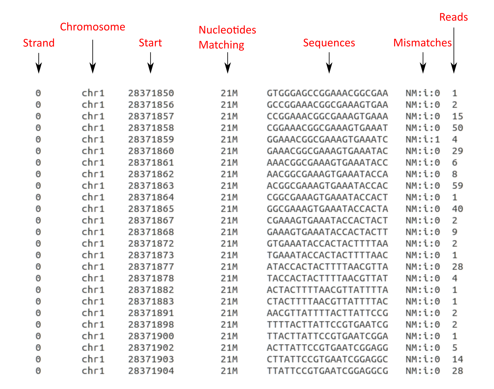

# Read_extractor 🧬📊

**Read_extractor** it's a simple Linux script that uses Samtools to obtain reads from several genomic loci in an sorted and indexed BAM file, using a list of *loci* from a .csv file. 

This script gets every read from the specified genomic location (formatted accordingly to the reference genome used), and counts how many times it's repeated, to finally add that number in a new column.

### Usage

-i: Path to input file. Must be a sorted and indexed BAM file.

-f: Path to csv file containing the list of *loci* to extract. You can easily format your *loci* to csv using Sed, e.g: if you have your *loci* in a calc or excel sheet, you can change the new line (`\n`) to comma (`,`) with `sed ':a;N;$!ba;s/\n/,/g' inputfile > output.csv `.

-s: Select sense or antisense strand. Works with SAM flags, select 0 for sense or 16 for antisense.

-r: Minimun number of reads to keep.

### Example

`./Read_extractor.sh -i input_sorted.bam -f Loci.csv -s 0 > ./output/sense.tab`

* Using `Read_extractor_individual.sh` will generate one file for each **locus** in the **loci** file, it will put the output files in the working directory, don't add ">".

**Your output should look like this one:**

